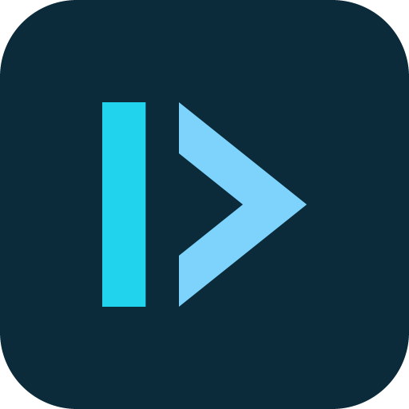

<p align="center">
  
</p>

<h1 align="center">Gofi Ecosystem — Harness</h1>

<p align="center">
  Repositório-fonte consumido pela CLI para gerar e manter projetos.<br>
  Nele vivem os <strong>agents</strong>, <strong>boilerplates</strong>, <strong>SDK docs</strong>,
  <strong>knowledge</strong> e <strong>memória</strong> que formam o <em>harness</em> sobre o qual a IA opera.
</p>

<p align="center">
  <a href="#instalação-da-cli">Instalação</a> ·
  <a href="#pipeline-de-agents-especializados">Agents</a> ·
  <a href="#gofi-ai--a-extensão-do-vscode">GOFI AI</a> ·
  <a href="#layout-do-repositório">Layout</a>
</p>

---

## Instalação da CLI

### Linux / macOS

```sh
curl -fsSL https://raw.githubusercontent.com/joaoprofile/gofi/main/install.sh | sh
```

### Windows (PowerShell)

```powershell
iwr -useb https://raw.githubusercontent.com/joaoprofile/gofi/main/install.ps1 | iex
```

### Versão específica

```sh
# Linux / macOS
GOFI_VERSION=v0.2.0 curl -fsSL https://raw.githubusercontent.com/joaoprofile/gofi/main/install.sh | sh

# Windows
$env:GOFI_VERSION = "v0.2.0"
iwr -useb https://raw.githubusercontent.com/joaoprofile/gofi/main/install.ps1 | iex
```

### Diretório de instalação customizado (Linux / macOS)

```sh
curl -fsSL https://raw.githubusercontent.com/joaoprofile/gofi/main/install.sh | sh -s -- --bin-dir /opt/gofi/bin
```

### Onde o binário é instalado

| OS | Local padrão | Observações |
|----|--------------|-------------|
| Linux / macOS | `/usr/local/bin/gofi` se gravável, senão `$HOME/.local/bin/gofi` | avisa sobre o PATH se `$HOME/.local/bin` não estiver em `$PATH` |
| Windows | `%LOCALAPPDATA%\Programs\gofi\bin\gofi.exe` | adiciona o diretório ao PATH do usuário (sem admin) |

> O instalador **sempre** verifica o SHA-256 contra `checksums.txt` antes de extrair.

Depois de instalar, rode `gofi h` para começar.

### Primeira execução — contexto da CLI (`gofi.json`)

Na primeira vez que a CLI roda em um terminal interativo, ela abre um assistente
curto para configurar o ambiente e grava as respostas em um **`gofi.json` ao lado
do executável** — uma instalação portátil leva a configuração junto.

| Configuração | Valores | Padrão |
|--------------|---------|--------|
| `language` | `en` (English) · `pt` (Português) · `fr` (Français) | detectado pelo `LANG` |
| `color` | `auto` · `always` · `never` | `auto` |
| `output` | `rich` · `plain` | `rich` |
| `checkin` | `true` · `false` — o `gofi` sem argumentos consulta o repositório de skills | `true` |

O idioma é escolhido no primeiro passo do assistente e as perguntas seguintes já
aparecem no idioma escolhido. Depois disso, toda a ajuda da CLI (`gofi h`,
resumos dos comandos, mensagens) é renderizada nesse idioma.

```sh
gofi settings                   # mostra as configurações ativas e o arquivo
gofi settings set language pt   # troca o idioma (en | pt | fr)
gofi settings set output plain  # texto puro, sem logo nem painéis
gofi settings wizard            # roda o assistente de novo
gofi settings path              # caminho do gofi.json
gofi settings reset             # volta aos padrões
```

Onde o arquivo fica e como sobrescrever:

- **Padrão:** `<pasta do executável>/gofi.json`.
- **Instalação de sistema** (pasta somente leitura, ex. `/usr/local/bin`):
  cai para `~/.gofi/gofi.json`.
- `GOFI_SETTINGS=/caminho/gofi.json` fixa um arquivo explícito.
- `GOFI_LANG=fr gofi h` troca o idioma só naquela execução, sem gravar nada.
- `GOFI_NO_SETUP=1` desliga o assistente da primeira execução.

Em CI, sem terminal, o assistente nunca aparece: a CLI usa os padrões em memória
e **não** grava `gofi.json`.

> `gofi settings` é a configuração **da CLI**; `gofi config` continua sendo a
> configuração **do projeto** (`.gofi.yaml`).

---

## DDA = SDD + SDK + Padrões + Boilerplates + Knowledge + Context

**DDA** é a fórmula. Cada parcela resolve uma classe de erro recorrente da IA
quando ela escreve código de produção:

```
DDA  =  SDD                  ← o QUE construir (especificação formal)
      + SDK                  ← o COMO construir (única fonte de verdade)
      + Padrões Arquiteturais ← Clean Arch, Hexagonal, CQRS quando couber
      + SOLID                ← invariantes de design no código gerado
      + DDD                  ← linguagem ubíqua, bounded contexts, agregados
      + Boilerplates         ← a ESTRUTURA por camada (model, repo, service…)
      + Knowledge            ← erros recorrentes virados em regra escrita
      + Context (MCP Light)  ← acesso a DB/API/infra via SDK + docs, sem MCP
```

**Harness Engineering** é a prática de manter essa fórmula viva: versionar
spec, SDK, boilerplates e knowledge como artefatos de primeira classe — não
como "documentação de apoio".

> Sem harness, a IA improvisa. Com harness, a IA executa.

---

## MCP Light — O Que É e Por Que Existe

**MCP Light** é a arquitetura ideal para quem **não precisa de um MCP server**
para que a IA acesse banco, APIs, serviços externos e infraestrutura.

Em vez de expor cada recurso via servidor MCP, o Gofi expõe via **contexto
estruturado**:

| Recurso real        | MCP tradicional                  | MCP Light (Gofi)                                     |
|---------------------|----------------------------------|------------------------------------------------------|
| Banco de dados      | `db-mcp-server`                  | `sdk/go/sdk-docs/sqln.md` + boilerplate `repository` |
| HTTP / APIs         | `http-mcp-server`                | `sdk/go/sdk-docs/netx.md` + boilerplate `handler`    |
| Auth                | `auth-mcp-server`                | `sdk/go/sdk-docs/iam.md`                             |
| Mensageria          | `queue-mcp-server`               | `sdk/go/sdk-docs/msq.md`                             |
| Observabilidade     | `obs-mcp-server`                 | `sdk/go/sdk-docs/obs.md`                             |
| Erros recorrentes   | (não cobre)                      | `knowledge/*.md`                                     |
| Decisões anteriores | (não cobre)                      | `memory/contexts/*.md`                               |

**Resultado:** a IA acessa os mesmos recursos, mas:

- Zero processo extra rodando
- Zero latência de IPC
- Zero auth/secret management para o harness
- Versionado junto do código
- Auditável por `git diff`

> MCP Light **não substitui** MCP em todos os cenários. Substitui no cenário
> mais comum: a IA escrevendo código que será executado por humanos/CI, e não
> a IA *executando* recursos em runtime.

---

## gofi graph — o mapa do código que o agente lê antes de abrir arquivo

O MCP Light resolve o acesso a **recursos**. Falta o acesso à **estrutura do
próprio projeto** — e o caminho natural do agente ali é varrer arquivos:
`grep`, `glob`, abrir dezenas de arquivos até montar o quadro. Isso queima
contexto e, pior, é impreciso: ele vê texto, não estrutura.

O `gofi graph` inverte isso. Extrai a estrutura de uma vez, grava em disco, e o
agente passa a consultar o grafo e abrir **só** os arquivos que a consulta
apontou.

> Escala real: a biblioteca padrão do Go tem 42 MB de código-fonte. O relatório
> que a descreve tem 22 KB. É o mapa que entra no contexto, não a cidade inteira.

### Não é um RAG

Um RAG quebra arquivos em pedaços, gera embeddings e recupera por similaridade —
"me traga o que se parece com isso". É probabilístico e opaco.

Aqui não há embedding, vector store nem chamada de API. O grafo é
**determinístico** e vem da árvore de sintaxe da linguagem. Cada aresta é um
fato verificável:

```json
{
  "from": "func:api.Bootstrap",
  "to":   "method:api.Server.Start",
  "rel":  "calls",
  "file": "api/api.go", "line": 41,
  "conf": 1
}
```

Toda aresta carrega **onde no código ela existe** e **quanta confiança** tem. A
mesma base de código sempre produz exatamente o mesmo JSON — diff limpo no git,
nenhuma surpresa entre execuções.

### Os dois modos

| | `fast` (padrão) | `--deep` |
|---|---|---|
| Motor | `go/ast` — só sintaxe | `go/types` — type-checker de verdade |
| Velocidade | 1,4 s para 336 pacotes / 700 mil linhas | ~10× mais lento |
| Chamada de método | só resolve quando o nome é único no módulo | resolve sempre, pelo tipo do receptor |
| Implementação de interface | não detecta | detecta |
| Exige que o projeto compile | não | sim |
| Confiança das arestas | 0,55 a 0,95 | 1,00 |

O modo rápido **se recusa a adivinhar**. Se dois tipos têm um método `Start()`,
ele conta a chamada como ambígua em vez de criar uma aresta que pode estar
errada — um grafo com aresta errada é pior que um grafo incompleto, porque o
agente confia nele.

### O que ele extrai

**Nós:** pacotes, structs, interfaces, tipos nomeados, funções e métodos — cada
um com arquivo, linha, assinatura e a primeira linha do doc comment.

**Arestas:** `contains`, `imports`, `calls`, `implements`, `embeds`, `uses`.

**Análise:** pontos centrais (maior acoplamento), instabilidade por pacote
(`I = saída/(entrada+saída)`), comunidades por Louvain determinístico, ciclos de
chamada por Tarjan, e conexões inesperadas — ligações que atravessam comunidades
por um caminho quase único, que ou são integração legítima ou vazamento de
camada.

Um símbolo pode declarar a qual contexto pertence com a diretiva
`//gofi:context <nome>` no doc do pacote; o `explain` então aponta a spec e a
memória daquele contexto.

### Escopos, lidos do `.gofi.yaml`

Um projeto gofi não é uma base de código, são várias — e quais pastas o grafo
varre sai do `.gofi.yaml`, nunca de convenção:

| Escopo | Pasta | Vem de | Stack |
|--------|-------|--------|-------|
| `project` | o código do time | `backend.path` | `backend.language` |
| `frontend` | a superfície web | `frontend.path` | `frontend.framework` |
| `mobile` | a superfície mobile | `mobile.path` | `mobile.framework` |
| `sdk` | o SDK vendorizado | `.gofi/gofi-sdk-<lang>/` | `backend.language` |

Linguagem e framework ficam gravados no grafo (`language`, `framework`) e no
índice, e abrem o relatório — quem abre um `gofi_graph.json` sozinho descobre ali
mesmo qual base de código ele descreve, sem deduzir pelos imports.

Cada um é um grafo próprio, porque cada um é lido por um extractor próprio:
juntar tudo exigiria um extractor que entendesse Go e TypeScript ao mesmo tempo,
e afogaria a estrutura do projeto em internals do SDK. Deixar de fora faria toda
chamada para lá terminar em beco sem saída — então uma consulta que erra num
escopo cai no seguinte.

A raiz também sai do arquivo (`project.root`), como no resto da CLI; se ela não
existe mais — o projeto foi clonado noutro caminho — vale o diretório onde o
`.gofi.yaml` está. Um escopo só é planejado quando a pasta existe **e** há
extractor capaz de lê-la: um projeto sem extractor de TypeScript é um projeto sem
grafo de front, não um build quebrado.

### Comandos

```sh
gofi graph build              # constrói (ou reconstrói) o grafo
gofi graph build --deep       # resolve chamadas pelo type-checker
gofi graph build --update     # sai em milissegundos se nenhum arquivo mudou
gofi graph explain Server.Start
gofi graph explain handler.Login --to store.User
gofi graph open               # visualização offline no navegador
gofi graph hooks --install    # pre-commit, post-checkout e post-merge
gofi graph install <lang>     # extractor de uma linguagem não-nativa
```

Saídas em `.gofi/graph/`:

- **`gofi_graph_report.md`** — o mapa compacto, o que o agente lê primeiro
- **`gofi_graph.json`** — a fonte de verdade, com todos os nós e arestas
- **`gofi_graph.html`** — visualização interativa, autocontida, sem CDN

### Versionado, e por quê

`.gofi/` inteiro fica fora do git — **menos `.gofi/graph/`**. O grafo é o mapa
que os agents leem: o time e a CI devem compartilhar o mapa que o código de fato
produziu, em vez de cada um reconstruir o seu. Quem clona já tem o mapa antes do
primeiro build. Os extractors (`.gofi/graph/extractors/`) continuam ignorados —
são binários baixados.

É a ordenação canônica do JSON que torna isso suportável de revisar: o mesmo
código gera exatamente os mesmos bytes, então o diff mostra a mudança de
estrutura, não ruído de serialização.

`gofi init` constrói o grafo e instala os hooks. O **`pre-commit`** reconstrói e
dá `git add` — o mapa viaja no mesmo commit do código que ele descreve.
`post-checkout` e `post-merge` são o conserto: normalmente não fazem nada, mas
um merge que resolveu o JSON linha a linha produz algo que build nenhum
emitiria, e é ali que se corrige. Todos rodam `gofi graph build --update`, que
compara hashes antes de qualquer trabalho pesado. O bloco escrito nos hooks é
delimitado e convive com husky/lefthook. `gofi doctor` avisa quando o grafo está
velho ou os hooks sumiram.

Nada disso é obrigatório: o bloco `graph:` do `.gofi.yaml` desliga o grafo
(`enabled: false`), só os hooks (`hooks: false`), fixa o modo (`deep: true`) ou
exclui diretórios (`exclude:`). A ausência do bloco significa tudo ligado.

### Outras linguagens

Go é nativo — a precisão vem de `go/ast` e `go/types`. Para as demais, o gofi
define um **protocolo de extractor externo**: um executável que emite NDJSON com
os mesmos nós e arestas. `gofi graph install <lang> --from <caminho|url>`
registra um no projeto (com verificação de `--sha256`), e daí em diante
`gofi graph build --lang <lang>` funciona igual.

### Limites conhecidos

- **`--deep` precisa que o projeto compile.** Usa os dados de export do `go list -export`; se faltarem, cai para o importador de código-fonte e segue com resolução parcial em vez de falhar.
- **Chamadas por variável de função e reflexão não aparecem.** Não existem estaticamente.
- **Módulos aninhados são ignorados.** Um subdiretório com `go.mod` próprio tem o próprio grafo.
- **A visualização mostra até 500 pacotes**, escolhidos por conectividade. Os demais continuam no grafo e nas consultas.

---

## Pipeline de Agents Especializados

Fluxo determinístico, cada agente com responsabilidade única. O **core**
(da ideia ao código auditado) é:

```
Requisito → gofi-pd → gofi-spec → gofi-eng → gofi-qa
            (PRD)      (SDD)       (backend)   (Auditoria)
                          │
                          └──────→ gofi-ui ──→ gofi-qa
                                   (frontend)
```

Cada agente é invocado como **skill** (`/gofi-pd`, `/gofi-spec`, …). No repo o
fonte é `ai/skills/<nome>/SKILL.md`; instalado, vira
`.claude/skills/<nome>/SKILL.md` — mesmo layout, o único que o Claude Code
descobre. Todos são **genéricos e
portáveis**: carregam apenas
metodologia; o que é específico do projeto vive em `specs/`, `memory/` e
`institutional/`.

### Core — do requisito ao código auditado

| Agente      | Responsabilidade                                  | NÃO faz                |
|-------------|---------------------------------------------------|------------------------|
| `gofi-pd`   | Product Discovery → PRD                            | Não escreve spec       |
| `gofi-spec` | Specification Architect → SDD                      | Não escreve código     |
| `gofi-eng`  | Context Engineer → backend 100% via SDK           | Não decide arquitetura |
| `gofi-ui`   | UI/UX Engineer → frontend (web/mobile) via DS     | Não decide arquitetura |
| `gofi-qa`   | Quality Auditor → aderência a spec + SDK          | Não altera código      |

### Apoio — entrega, documentação e estado

| Agente        | Responsabilidade                                          | NÃO faz                  |
|---------------|----------------------------------------------------------|--------------------------|
| `gofi-ops`    | Platform & Delivery → IaC, build e CI/CD a partir de spec | Não escolhe cloud/sizing |
| `gofi-doc`    | Documentation Generator → doc de API p/ front e QA        | Não edita código         |
| `gofi-status` | Índice de contextos derivado do `memory/contexts/*.md`    | Não escreve nada         |

### Orquestração — o ciclo inteiro sem tirar a mão

| Agente       | Responsabilidade                                                | NÃO faz                     |
|--------------|-----------------------------------------------------------------|-----------------------------|
| `gofi-full`  | Encadeia `pd → spec → eng → qa` e **volta à fase anterior** quando o QA reprova, até passar sem ressalvas | Não pula o QA nem aprova sozinho |

O `gofi-full` é o que fecha o laço. Sem ele o pipeline seria uma sequência de
prompts; com ele, uma reprovação do `gofi-qa` devolve o trabalho à etapa que a
causou — e o ciclo só termina quando a auditoria passa limpa.

A separação é o ponto: cada agente lê apenas o contexto da sua etapa, e o
output de um é input do próximo. **Sem sobreposição = sem inconsistência.**

---

## gofi-ui — Frontend com Design System (web e mobile)

O `gofi-ui` implementa a camada de apresentação a partir da spec (e do contrato
de API do `gofi-eng`). Ele **não cria componentes do zero**: consome um **Design
System publicado como dependência npm**, escolhido pela **superfície** do alvo —
não pelo framework cru:

| `ui.framework` (no `.gofi.yaml`) | Superfície | Design System (pacote npm) | Docs em                       |
|----------------------------------|------------|----------------------------|-------------------------------|
| `react` (`angular`/`vue`)        | **web**    | **`gofi-ui`**              | `sdk/web/gofi-ui/`            |
| `react-native` / `expo`          | **mobile** | **`gofi-ui-native`**       | `sdk/mobile/gofi-ui-native/` |

> A pasta de docs **é o nome do pacote**. Os `.md` do DS são a **especificação
> domínio-neutra** (tokens, componentes, patterns) que a lib implementa — não
> código a copiar. O agente faz `import { Button } from 'gofi-ui'`, nunca recria.

**Um projeto pode ter uma superfície ou as duas** (full-stack com backend Go +
web + mobile). Ambas bebem dos **mesmos tokens**
(`knowledge/ui/design-tokens.md`); muda só a **forma**:

| Tema   | `gofi-ui` (web)                          | `gofi-ui-native` (mobile)              |
|--------|-----------------------------------------|----------------------------------------|
| Stack  | React + TS + **Tailwind v4**            | React Native + TS                      |
| Tokens | utilitários (`bg-action`, `text-ink`)   | objeto TS (`makeTheme` + `useTheme()`) |
| Tema   | `[data-theme]` (light/dark)             | `useColorScheme()` + `<ThemeProvider>` |
| Navegação | rotas/URL                            | React Navigation (stack/tab) + safe-area |

Cada DS é organizado em **`foundations/`** (cor, tipografia, espaçamento,
acessibilidade…), **`components/`** (button, card, input, charts…) e
**`patterns/`** (app-shell, forms, states, page-templates…), com `gofi.md` como
ponto de entrada. **Nunca** se aplica o DS de uma superfície na outra.

---

## GOFI AI — a extensão do VSCode

O painel onde o pipeline é operado. Empacotada dentro do binário da CLI, então
instala sem rede e sem toolchain Node:

```sh
gofi install extensions          # instala/atualiza em todo editor no PATH
gofi install extensions --list   # o que está instalado, e em que versão
```

O `gofi init` já faz isso ao criar o projeto.

Por baixo ela conversa com o Claude pela CLI do Claude Code, **rodando na raiz
do workspace**. É essa escolha que faz dela um chat *do gofi* e não um chat
genérico: o processo herda o `.claude/` do projeto, então as nove skills viram
comandos do chat e o agente lê spec, memória e knowledge sem nenhuma ligação
extra.

| | |
|---|---|
| **`/`** | chama uma skill do projeto, com autocomplete |
| **`@`** | referencia um arquivo, por busca aproximada |
| **`+`** | anexa um arquivo do computador (imagem, código, markdown, pdf) |
| **`Ctrl+V`** | cola uma imagem direto na conversa |
| **abas** | várias conversas em paralelo, cada uma com contexto próprio |

O `+` abre o **diálogo do sistema operacional** — qualquer pasta do computador em
que você está. Uma imagem vai como imagem para o modelo; um arquivo **do
computador** vai com o conteúdo, porque o motor roda na raiz do workspace e não
alcança aquele caminho — em janela remota (WSL, SSH, container) nem é a mesma
máquina. Para arquivo **do projeto** use `@`: aí vai o caminho, e o agente lê se
precisar, o que evita despejar mil linhas no prompt para usar dez.

### Aprovação por ação

Cada `Edit`, `Write`, `NotebookEdit` e `Bash` para e pede autorização, mostrando
o diff ou o comando. **Permitir** vale para aquela chamada; **Sempre permitir**
vale só para aquela ferramenta e só naquela conversa — e não sobrevive a limpar
ou fechar o chat. Recusar leva o motivo de volta ao agente, então "não, faça
assim" é um passo só.

O bloqueio é do próprio motor (hook `PreToolUse`), não uma instrução no prompt:
enquanto a resposta não vem, a chamada não acontece. E falha fechado — sem
resposta, painel fechado ou erro, a alteração é negada.

### Medidor de tokens e auditoria de RAG

A barra do topo mostra, enquanto o agente trabalha, entrada nova, lida do cache,
gravada no cache e saída. Abrindo, aparece cada busca com quanto trouxe para o
contexto, marcada `alvo` quando limitou o próprio escopo e `inteiro` quando não.

Quando um documento não pode ser lido barato — sem frontmatter, sem `keywords`,
sem seções `##`, ou faltando o `INDEX.md` do corpus — o painel aponta **onde
mexer**, mostra o trecho a inserir e oferece o botão que manda o agente
corrigir. Tudo isso é calculado localmente: **medir não gasta token**.

---

## Layout do Repositório

Mistura conteúdo **genérico cross-AI/cross-language** (agents, knowledge
shared, templates) com **conteúdo específico por linguagem** sob `sdk/<lang>/`.
A pasta `ai/<provider>/` contém o que é específico do provedor de IA.
Em v1 só Claude Code é suportado.

```
.
├── skills/                   — um arquivo por agente (fonte da skill /gofi-*)
│   ├── gofi-pd.md            — Product Discovery
│   ├── gofi-spec.md          — Specification Architect
│   ├── gofi-eng.md           — Context Engineer (backend)
│   ├── gofi-ui.md            — UI/UX Engineer (web/mobile)
│   ├── gofi-qa.md            — Quality Auditor
│   ├── gofi-ops.md           — Platform & Delivery (IaC/CI/CD)
│   ├── gofi-doc.md           — Documentation Generator
│   ├── gofi-status.md        — Índice de contextos
│   └── gofi-full.md          — Full-Cycle Orchestrator
├── knowledge/
│   ├── shared/               — knowledge cross-agent/cross-language
│   ├── eng/                  — knowledge do gofi-eng
│   └── ui/                   — tokens, theming, ux-principles (gofi-ui)
├── specs-template/sdd-template.md
├── prd-template/prd-template.md
├── memory/
│   ├── project.md.tmpl       — semeado pelo `gofi init`
│   └── contexts/             — vazio inicialmente
├── ai/
│   └── claude/
│       ├── CLAUDE.md         — instruções raiz para Claude Code
│       └── README.md         — visão geral consumida no onboarding
├── cli/                      — código-fonte da CLI Go (módulo gofi-cli)
├── gofi-ai/                  — extensão GOFI AI do VSCode (empacotada na CLI)
├── assets/                   — logo do projeto
└── sdk/
    ├── go/                   — backend
    │   ├── boilerplates/     — model, repository, service, handler, …
    │   ├── sdk-docs/         — netx, sqln, iam, msq, obs, …
    │   └── knowledge/        — error-handling, pagination, value-objects, …
    ├── web/                  — frontend web
    │   ├── gofi-ui/          — Design System (foundations, components, patterns)
    │   ├── boilerplates/     — feature, page-route
    │   └── knowledge/        — structure, absolute-rules
    └── mobile/               — frontend mobile
        ├── gofi-ui-native/   — Design System (foundations, components, patterns)
        ├── boilerplates/     — screen, navigation
        └── knowledge/        — structure, absolute-rules
```

---

## Como a CLI Consome Este Repo

`gofi init` baixa este repo (um único tarball) e mescla em `<projeto>/.claude/`:

| Origem                                 | Destino                            |
|----------------------------------------|------------------------------------|
| `ai/skills/<nome>/` (todas)            | `.claude/skills/<nome>/`           |
| `ai/claude/CLAUDE.md`                  | `.claude/CLAUDE.md`                |
| `specs-template/`                      | `.claude/specs-template/`          |
| `prd-template/`                        | `.claude/prd-template/`            |
| `knowledge/`                           | `.claude/knowledge/`               |
| `memory/project.md.tmpl` (rendered)    | `.claude/memory/project.md`        |
| `sdk/<surface>/boilerplates/`          | `.claude/sdk/<surface>/boilerplates/` |
| `sdk/<surface>/knowledge/`             | `.claude/sdk/<surface>/knowledge/`    |
| `sdk/go/sdk-docs/`                     | `.claude/sdk/go/sdk-docs/`            |
| `sdk/web/gofi-ui/` · `sdk/mobile/gofi-ui-native/` | `.claude/sdk/<surface>/<ds>/` (Design System) |

> `<surface>` é `go` (backend), `web` ou `mobile` — selecionada conforme
> `project.language` e o bloco `ui` do `.gofi.yaml`.

Isso é o `gofi init`. **Depois que o projeto existe, nada disso se move
sozinho** — os arquivos são do time, e alterá-los é manual no próprio
repositório. Tudo que o projeto puxa do upstream mora numa família só, um alvo
para cada coisa:

| Comando | Escreve |
|---------|---------|
| `gofi update skills` | `.claude/skills/`, e nada mais |
| `gofi update sdk` | `.gofi/gofi-sdk-<lang>/`, `.claude/sdk/<lang>/` e o `go.work` |
| `gofi update ds` | `.claude/sdk/<surface>/` — o design system de cada frontend |
| `gofi update graph` | `.gofi/graph/` e os hooks git |
| `gofi update institutional` | `.claude/institutional/<projeto>/` — espelho, substitui inteiro |
| `gofi update audit` | **nada** — só reporta o que ficou para trás |

**Não existe `gofi update` sem alvo**, de propósito: "atualiza o projeto" não é
uma decisão que alguém consiga revisar, "atualiza as skills" é. Sem alvo, o
comando lista os alvos.

**Todo alvo diz o que vai fazer antes de fazer:**

```
This run:

  WRITES        .claude/skills/  9 file(s): 2 new, 3 changed
  KEEPS         2 file(s) you edited
  LEAVES ALONE  .gofi.yaml, CLAUDE.md, templates/, scripts/, sdk/,
                knowledge/, memory/, institutional/, go.work
```

A linha `LEAVES ALONE` é a que importa: ela responde "o que mais isso vai
mexer?" antes de mexer. O bloco sai **sempre** — inclusive com `--yes` e
inclusive quando não há pergunta nenhuma depois.

**Confirmação é para o que você pode perder, não para o que você pediu.** Nomear
o alvo já foi a decisão; perguntar de novo seria cerimônia, e pergunta que
aparece toda hora é pergunta que ninguém lê. Só dois casos pedem resposta:

| Situação | Pergunta? |
|---|---|
| Refresh normal de `skills`, `sdk`, `ds` | não — o que você editou é preservado |
| `graph` | não — é saída derivada; refazer custa segundos |
| `--force` **sobre arquivos que você editou** | **sim** — é o único jeito de perder trabalho |
| `--force` sem nenhum arquivo seu no caminho | não — não há o que destruir |
| `institutional` | **sim** — é wipe + recópia, sempre |
| Nada a mudar | não — perguntar se você quer fazer nada é o pior prompt que existe |

Quando pergunta, o cabeçalho do bloco vira `On Yes:` e `--yes` responde por
você. Com `--force`, o `KEEPS` vira `OVERWRITES`, guardando cópia em
`.gofi/backup/`.

O que ficou para trás e nenhum alvo repara aparece no `gofi update audit`, que
só reporta — cada achado nomeia o comando que fecha ele, ou diz que nenhum fecha.
Você não precisa lembrar de rodar: todo alvo termina com uma linha de contagem
quando há algo, e cala a boca quando não há.

```
Skills updated — .claude/skills/ now at a1b2c3d.
3 structure finding(s), 1 needing attention — run `gofi update audit`.
```

---

## Build a Partir do Código-Fonte

O código da CLI vive em [`cli/`](cli/) (módulo `github.com/joaoprofile/gofi-cli`).

```sh
cd cli
go build -o bin/gofi ./cmd
./bin/gofi h
```

Para um build local versionado:

```sh
cd cli
go build \
  -ldflags "
    -X github.com/joaoprofile/gofi-cli/internal/cli.Version=v0.0.0-dev
    -X github.com/joaoprofile/gofi-cli/internal/cli.Commit=$(git rev-parse --short HEAD)
    -X github.com/joaoprofile/gofi-cli/internal/cli.BuildDate=$(date -u +%Y-%m-%dT%H:%M:%SZ)
  " \
  -o bin/gofi ./cmd
```

Releases são publicadas via GoReleaser quando uma tag `v*` é enviada
(ver [`.github/workflows/release.yml`](.github/workflows/release.yml) e
[`cli/.goreleaser.yaml`](cli/.goreleaser.yaml)).

---

## Conclusão

O Gofi Ecosystem transforma o desenvolvimento com IA em um processo
**determinístico, padronizado, auditável e evolutivo**.

Não é "gerar código com IA". É construir o **harness** onde:

- A arquitetura é respeitada por construção (DDA)
- A fundação é **código real do SDK**, não invenção do modelo — e os agentes
  leem a documentação destilada dele, nunca os fontes
- Recursos reais são acessados sem MCP server (MCP Light)
- A qualidade é garantida por auditoria automática (`gofi-qa`), e o ciclo só
  fecha quando ela passa (`gofi-full`)
- Nada é escrito sem aprovação explícita (GOFI AI)
- O conhecimento é acumulado entre execuções (knowledge + memory)

> **Harness Engineering: a disciplina de fazer a IA escrever código como o
> seu melhor engenheiro escreveria — todas as vezes.**
