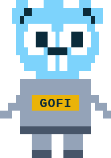
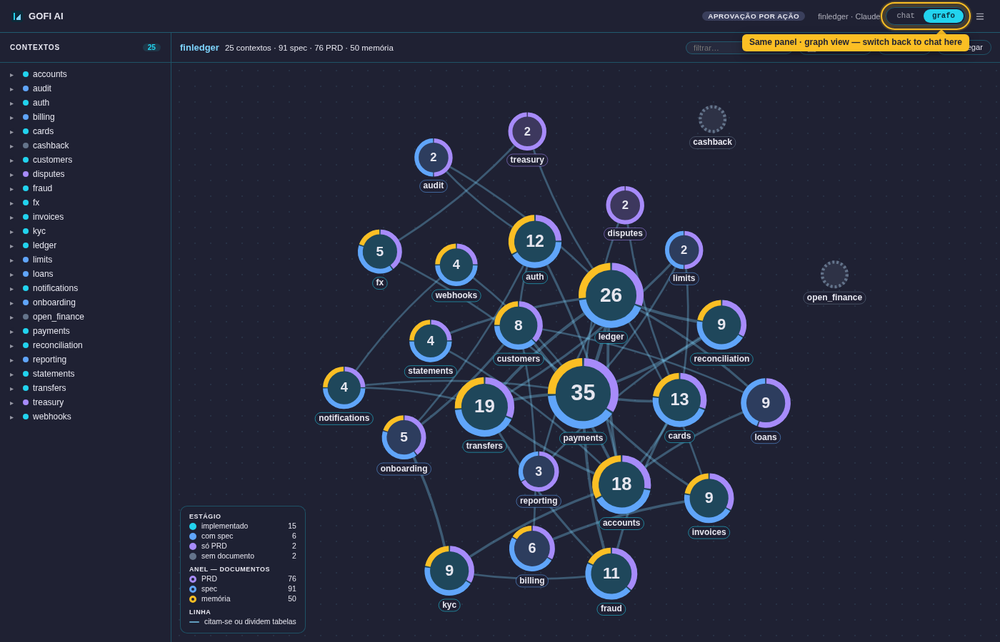
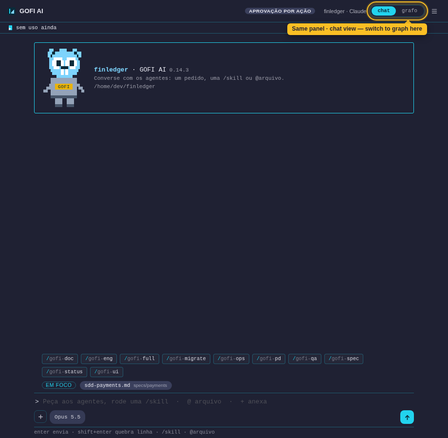

<p align="center">
  
</p>

<h1 align="center">Gofi — an AI harness for software teams</h1>

<p align="center">
  Specialist agents, a map of your code and documents, and a front door that plans
  every request — so AI writes production code the way your best engineer would,
  and spends the expensive model only on work that needs it.
</p>

<p align="center">
  <a href="#what-is-gofi">What</a> ·
  <a href="#how-it-works">How it works</a> ·
  <a href="#quick-start">Quick start</a> ·
  <a href="#core-concepts">Concepts</a> ·
  <a href="#cli-reference">CLI</a> ·
  <a href="#the-gofi-ai-extension">Extension</a> ·
  <a href="#author">Author</a>
</p>

---

## What is gofi?

Gofi is a **harness** for building software with AI coding agents (Claude Code
first; any agent that reads `AGENTS.md` or speaks MCP benefits from most of it).
It is three things that work together:

1. **A set of specialist agents** — product discovery, specification,
   backend, frontend, platform, QA, documentation — each one a portable *skill*
   with a single responsibility, a contract, and the model tier it needs.
2. **A map of the project** — a deterministic graph of the **code** and an index
   of the **documents** (PRDs, specs, context memory, reference knowledge), so an
   agent asks *where* before it reads, and reads only the lines that answer.
3. **A front door** — every request typed in free text is planned by rules
   first, at no token cost: what it asks for, which context it is about, what is
   missing, which roles run, at which tier. The expensive model receives closed
   work: an assembled request or an approved spec.

All of it stands on the **gofi SDKs** — [gofi-sdk-go](https://github.com/joaoprofile/gofi-sdk-go)
and [gofi-sdk-rust](https://github.com/joaoprofile/gofi-sdk-rust) — which fix the
engineering structure and practices the agents build with (see
[The SDKs](#the-sdks--the-deterministic-foundation)).

Gofi ships as a **CLI** (`gofi`, written in Go), a **VS Code extension** (the
*GOFI AI* panel, bundled inside the CLI), and this repository — the source of
the agents, templates, expertise packs and SDK docs that `gofi init` installs
into a project.

## Why it exists

Coding agents are powerful and wasteful in the same ways:

| Without a harness | With gofi |
|---|---|
| A vague prompt reaches the most expensive model, which explores the repository to guess what you meant | The request is planned by rules first; what is open becomes a question with options, asked **before** any model reads it |
| The agent greps and opens dozens of files to understand a feature | `gofi find` / `gofi show` answer with `file#section L12-26` — the agent reads those lines |
| One big conversation carries every phase; context grows forever | Each phase runs in a fresh session; phases hand over through files on disk |
| The same model writes a status report and a system design | Each role runs at its tier: light, standard or deep |
| Architecture drifts; the model invents patterns | Specs, SDK docs, boilerplates and the team's written learnings are the source of truth |
| What the team learned is lost between sessions | Learnings live in `knowledge/`, state in `memory/`, decisions in `specs/` and `prd/` |

> Without a harness, AI improvises. With a harness, AI executes.

---

## How it works

```
 "change the pricing flow, adding a rate limit"
        │
        ▼
┌─ 1. The gofi front door — rules, no model (milliseconds, 0 tokens) ──────────┐
│   lexicon: intent (create/change/fix/review/explain…) and artifact           │
│   document index + code graph: which context, what it already has           │
│   role contracts: the phases from where the context is to what was asked    │
└──────────────────────────────────────────────────────────────────────────────┘
        │ something still open? (no known verb, two contexts tied)
        ▼
┌─ 2. A light model (Haiku) — one lean call, only when needed (~5 s, ~$0.005) ─┐
│   gets the request, the options and the pointers; picks among the options    │
│   or says it has no basis — never invents a context                          │
└──────────────────────────────────────────────────────────────────────────────┘
        │ still open?
        ▼
┌─ 3. You — questions with options taken from the index (0 tokens) ────────────┐
        │
        ▼
┌─ 4. The roles run — each in a fresh session, at its tier ────────────────────┐
│   /gofi-spec (deep)   writes the spec at once, with your decisions           │
│        ⏸ you review and approve the spec                                     │
│   /gofi-eng (standard) implements from the spec and the pointers             │
│   /gofi-qa (standard)  audits; fails → re-implement one tier up, audit again │
└──────────────────────────────────────────────────────────────────────────────┘
        │
        ▼
   artifacts on disk (spec, code, context memory) + a record in .gofi/runs/
```

A greeting ("hi") goes straight to the conversation. A question about the
project ("explain how pricing works") goes to the conversation **with pointers**
to the sections that answer it. A skill invoked directly (`/gofi-eng …`) runs as
typed.

---

## Quick start

**Requirement:** [Claude Code](https://docs.claude.com/en/docs/claude-code)
**2.1.277 or newer** — the first version that reads `AGENTS.md`. The index and
search commands (`index`, `find`, `show`, `path`, `mcp`) do not depend on it and
serve any agent (Codex, Copilot, Cursor) through `AGENTS.md` and MCP.

```sh
# 1. Install the CLI (Linux / macOS)
curl -fsSL https://raw.githubusercontent.com/joaoprofile/gofi/main/install.sh | sh
#    Windows (PowerShell)
#    iwr -useb https://raw.githubusercontent.com/joaoprofile/gofi/main/install.ps1 | iex

# 2. Create a project (or adopt an existing repository) — an interactive wizard
gofi init my-project

# 3. Ask for work, in your own words
gofi chat                                           # interactive, in the terminal
gofi ask "create a PRD for order synchronization"   # one call, script-friendly
#    …or open the GOFI AI panel in VS Code (installed by gofi init)
```

`gofi init` installs the agents, the MCP server, the guard hook, the git hooks
and the VS Code extension, and builds the first code graph and document index.
Run `gofi h` for help on any command.

<details>
<summary><b>More install options</b></summary>

```sh
# A specific version
GOFI_VERSION=v0.2.0 curl -fsSL https://raw.githubusercontent.com/joaoprofile/gofi/main/install.sh | sh
$env:GOFI_VERSION = "v0.2.0"; iwr -useb https://raw.githubusercontent.com/joaoprofile/gofi/main/install.ps1 | iex

# A custom install directory (Linux / macOS)
curl -fsSL https://raw.githubusercontent.com/joaoprofile/gofi/main/install.sh | sh -s -- --bin-dir /opt/gofi/bin
```

| OS | Default location | Notes |
|---|---|---|
| Linux / macOS | `/usr/local/bin/gofi` if writable, else `$HOME/.local/bin/gofi` | warns when `$HOME/.local/bin` is not on `PATH` |
| Windows | `%LOCALAPPDATA%\Programs\gofi\bin\gofi.exe` | adds the folder to the user `PATH` (no admin) |

The installer always verifies the SHA-256 against `checksums.txt` before
extracting.

**CLI settings (`gofi.json`).** On the first interactive run the CLI asks for
its language (`en` · `pt`), colour and output style, and saves them in
`gofi.json` next to the binary (or `~/.gofi/gofi.json` when that folder is
read-only). `gofi settings` shows and changes them; `GOFI_LANG=pt` switches the
language for one run; `GOFI_NO_SETUP=1` skips the wizard; CI never sees it.
`gofi settings` configures the CLI — `gofi config` configures the project
(`.gofi.yaml`).

</details>

---

## Core concepts

### 1. The harness

Gofi's formula for AI that writes production code:

```
DDA  =  SDD            ← WHAT to build (formal specification)
      + SDK            ← HOW to build it (the single source of truth)
      + Architecture   ← Clean/Hexagonal, CQRS where it fits, SOLID, DDD
      + Boilerplates   ← the STRUCTURE of each layer (model, repo, service…)
      + Knowledge      ← recurring mistakes turned into written rules
      + Context        ← databases, APIs and infra reached through SDK docs
```

**MCP Light.** Real resources — database, HTTP, auth, messaging, observability —
are reached through *structured context* (the SDK's generated API reference,
knowledge notes and boilerplates), not one MCP server per resource: no extra
process, no secrets for the harness, versioned with the code, auditable by
`git diff`. It covers the most common case: AI writing code that humans and CI
will run.

#### The SDKs — the deterministic foundation

The single biggest source of non-determinism in AI-written code is the model
choosing *how* to build: which layers, which libraries, which way to talk to a
database, handle an error, publish an event. Gofi removes that choice. Each
project is built on a **gofi SDK** that fixes the engineering structure and the
good practices once — and the agents compose from it instead of inventing:

| SDK | Language | |
|---|---|---|
| [**gofi-sdk-go**](https://github.com/joaoprofile/gofi-sdk-go) | Go | the reference SDK, used by the CLI and the agents today |
| [**gofi-sdk-rust**](https://github.com/joaoprofile/gofi-sdk-rust) | Rust | the same engineering model, for Rust services |

An SDK gives the harness:

- **One way to do each thing** — persistence, HTTP handlers, auth/IAM,
  messaging, scheduling, configuration, errors, observability — built, tested
  and versioned, so the same spec produces the same shape of code.
- **Layers the agents fill, not design** — model, repository, service, handler,
  adapter — with a **boilerplate** per layer in `.claude/sdk/<lang>/boilerplates/`.
- **An API reference generated from the SDK's own code** at the pinned version
  (`.claude/sdk/<lang>/api/`), so the agent reads what the SDK really exposes
  instead of guessing signatures — and never opens the SDK's sources to decide.
- **Knowledge notes** (`.claude/sdk/<lang>/knowledge/`) — the rules and traps of
  using it, written down once.
- **A pinned version.** `gofi update sdk` moves the checkout
  (`.gofi/gofi-sdk-<lang>/`), its docs and `go.work` together, so the agents
  always read the SDK the code compiles against.

The spec says **what** to build; the SDK says **how**. Between the two, very
little is left for the model to improvise — which is what makes the output
predictable.

**Two zones, one owner each.** Everything gofi installs lives in the agents'
folder (`.claude/` for Claude Code, `.agents/` for hosts that follow the open
skills convention):

| Zone | Contains | Written by |
|---|---|---|
| **gofi** | `skills/`, `expertise/`, `templates/`, `sdk/<lang>/`, gofi's block of `AGENTS.md` | `gofi update` — the team corrects it through `knowledge/`, not by editing it |
| **project** | `.gofi.yaml`, `knowledge/`, `memory/`, `institutional/`, `lexicon/`, `specs/`, `prd/`, the project's block of `AGENTS.md` | the team — `gofi update` **never** writes here |

- **`AGENTS.md`** — the instructions every agent reads: common laws, where
  things live, and *plan before you start*.
- **Skills** stay small (≈2k tokens each); the detail lives in
  `skills/<role>/reference/` and is opened section by section.
- **Expertise packs** (`expertise/<pack>/`) — portable technique: harness
  protocols (always on), DDD architecture, event-driven, diagramming, UI design,
  platform delivery, code review. Each `PACK.md` says when it applies.
- **Team learning** (`knowledge/`) wins over expertise and SDK docs when they
  disagree; a correction declares `overrides: <file>#<section>` and search shows
  it in place of the rule it corrects.
- **Memory** (`memory/contexts/<context>.md`) — the state of each context:
  frontmatter (`status`, `versao`, …) and a *current state* section.
- **Lexicon** (`lexicon/`) — the business's synonyms (order = pedido), optional.

### 2. Specialist agents

Each agent is a skill with one responsibility and a **contract**
(`contract.yaml`): its tier, what it produces, what it needs first, who follows
it. Plans are built from contracts — a team's own skill with a contract is
routed like gofi's, with no change to the CLI.

| Agent | Tier | Delivers | Does not |
|---|---|---|---|
| `/gofi-pd` | deep | PRD — problem, actors, rules, acceptance criteria | write a spec |
| `/gofi-spec` | deep | SDD spec — model, API, architecture, data profile | write code |
| `/gofi-eng` | standard | backend, through the SDK and the spec | decide architecture |
| `/gofi-ui` | standard | web/mobile UI, through the design system | decide architecture |
| `/gofi-ops` | standard | IaC, build and CI/CD, from an infra spec | choose cloud or sizing |
| `/gofi-qa` | standard | audit against the spec and the SDK rules | change code |
| `/gofi-doc` | light | API contract docs for front-end and QA | edit code |
| `/gofi-status` | light | the panorama of contexts, from their memory | write anything |
| `/gofi-migrate` | standard | migrates an older document corpus to the indexed format | — |
| `/gofi-full` | deep | runs `pd → spec → eng → qa` inside the agent, back to the phase at fault when QA fails | skip QA |

```
Requirement → gofi-pd → gofi-spec → gofi-eng → gofi-qa
              (PRD)     (SDD)       (backend)  (audit)
                            └──────→ gofi-ui ──→ gofi-qa
```

Skills are **generic and portable**: they carry methodology only. Anything
specific to a product lives in `specs/`, `memory/` and `institutional/`.

### 3. The front door: `gofi intake`

```sh
gofi intake "change the pricing flow, adding a rate limit"
gofi intake "create a PRD for order synchronization" --answer context=new
gofi intake "change the rules" --proceed --json
```

Every surface — terminal chat, `gofi ask`, the VS Code panel, the Claude Code
hook, the MCP tool — goes through the same six steps:

1. **Reception.** `/skill …` passes as typed. A message that is **no task** (no
   task verb, no artifact, nothing of the project — "hi", "thanks") goes as
   typed too, with no plan and no model.
2. **Understanding, by rules** (0 tokens). The intent — *create, change, fix,
   review, document, status, migrate, deploy, explain* — and the artifact, from
   the lexicon (Portuguese and English everyday verbs: *implement, improve,
   resolve, verify, explain, "how does it work"…*) and the contracts' verbs.
   Generic verbs (*do, want, need*) decide only when nothing else does. The
   context comes from its name, the lexicon, the `keywords` of its documents
   (a request in Portuguese finds a context named in English) or the search.
3. **State** of the context from the document graph: has a PRD? a spec? code?
4. **Plan** from the contracts, each phase with its tier and the reason. A
   context coupled to three or more neighbours raises the writing phases to deep.
5. **Sufficiency.** What is missing becomes a question with options from the
   index. A change that only points ("fix that login thing") asks what changes.
6. **Assembled request.** Goal, change, done criterion, context, constraints,
   out of scope, expertise, assumptions and **evidence** — `file#section` pointers
   with line ranges, within a token budget.

**A question about the project** (*"explain how pricing works"*) has no role and
no phases: it goes to the conversation with the pointers to the sections that
answer it, and the model reads those lines instead of searching the tree.

**The light model is the last resort.** When the rules leave the intent or the
context open, one lean call to the host's light tier (no project loaded, no
tools, a closed answer schema, cached by what was asked) settles it or says it
has no basis. A new context is never the model's call — it stays a question.
Two rounds at most: answer (`--answer id=value`) or go on with the defaults
(`--proceed`), each default written down as an assumption.

`gofi intake --serve` stays open and plans one JSON request per line with the
index kept loaded — ~10 ms per request instead of ~0.4–0.8 s. The extension
plans every message this way.

### 4. Agentic work: the expensive model only gets closed work

When gofi conducts a plan (`gofi chat`, `gofi ask`, the panel):

- **Each phase runs in a fresh session.** A phase does not inherit the previous
  conversations; what it needs is on disk — the spec, the context memory, the
  code.
- **Elicitation before PRD and spec.** A cheaper phase walks the skill's own
  checklist against the request and the project, and writes to `.gofi/elicit/`
  only the decisions nothing answers, each with a recommended option. You answer;
  the deep role writes the document **at once** — no interview — as a draft.
  **You approve it** at the review stop.
- **Blocks instead of chat.** An implementation that finds a decision the spec
  does not cover writes the question and stops. Your answer is recorded in the
  spec (standard tier, **no version bump**) and the implementation runs again.
- **Escalation by evidence.** QA failed (`status: reprovado` in the context
  memory)? The implementation runs again **one tier up**, then QA again — once.
  Failed again: the plan stops with the findings for you.
- **Memory through gofi.** Claude Code treats `.claude/` as sensitive and asks
  before every edit there; an agent working on its own writes the context memory
  with `gofi memory write <context>`, which checks the frontmatter first.
- **Everything recorded** in `.gofi/runs/` (outside git): the request, what was
  decided and why, each phase's tier, model, time and cost, QA's verdict and the
  outcome.

Invoked directly, the skills work as before, with questions in the conversation.

### 5. The right model for the job

Gofi speaks in **tiers**, never models; the host maps them, and a project can pin
the versions in `.gofi.yaml` (`ai.tiers`).

| Tier | For | Roles | Claude Code |
|---|---|---|---|
| **light** | reading and answering; settling an open point of the intake | `gofi-status`, `gofi-doc`, the intake's consult | Haiku |
| **standard** | writing within a defined scope, reviewing, gathering decisions | `gofi-eng`, `gofi-ui`, `gofi-ops`, `gofi-qa`, `gofi-migrate`, elicitations, spec records | Sonnet |
| **deep** | turning decisions into a coherent PRD or spec | `gofi-pd`, `gofi-spec`, `gofi-full`, the retry after a failed audit | Opus |

On install, the tier becomes `model:` in the skill's frontmatter — Claude Code
switches model for the skill's turn only. The **session** (free conversation,
outside a plan) starts on Sonnet in `gofi init`. The tier goes **up** for a
widely coupled context, after a failed audit or when you ask (`--tier deep`), and
**down** for elicitation and spec records. It never goes down where quality
drops: measured, an elicitation on Haiku cost 72% less but recommended scope the
PRD never asked for.

### 6. The code graph

`gofi index code` extracts the structure of the code once and saves it; the agent
queries it instead of scanning files.

```sh
gofi find "<question>"                  # documents and code, ranked
gofi find --in code "<term> <term>"     # a symbol by its description
gofi find --text "<literal>"            # exact text (--regex, -i), each line under its symbol or §section
gofi show Server.Start                  # signature, doc, file:lines, callers and callees
gofi path handler.Login store.User      # how A reaches B, edge by edge
```

**Not a RAG.** No embeddings, no vector store, no API call. The graph comes from
the language's syntax tree and is **deterministic** — the same code produces the
same bytes, so it diffs cleanly and is **versioned** in `.gofi/index/code/` for
the team and CI to share.

| | `fast` (default) | `--deep` |
|---|---|---|
| Engine | `go/ast` — syntax only | `go/types` — the real type-checker |
| Speed | 1.4 s for 336 packages / 700k lines | ~10× slower |
| Method calls | resolved only when the name is unique | always, by receiver type |
| Interface implementations | not detected | detected |
| Needs the project to compile | no | yes |

The fast mode **refuses to guess**: an ambiguous call is counted as ambiguous,
never turned into an edge that might be wrong — a graph with a wrong edge is
worse than an incomplete one, because the agent trusts it.

- **Nodes:** packages, structs, interfaces, named types, functions, methods —
  each with file, line, signature and the first line of its doc comment.
- **Edges:** `contains`, `imports`, `calls`, `implements`, `embeds`, `uses`.
- **Analysis:** central points, instability per package, Louvain communities,
  Tarjan call cycles, unexpected cross-community links.
- **Scopes** come from `.gofi.yaml`: the backend, each front-end surface, the
  vendored SDK — one graph each, and a query that misses one scope falls to the
  next.
- **Git hooks** keep it in the commit: `pre-commit` rebuilds it (incrementally)
  into the same commit; `post-checkout` and `post-merge` refresh the local copy.
  They never block git.
- **Other languages** plug in through an external extractor protocol (NDJSON):
  `gofi index install <lang>`.

> Scale: Go's standard library is 42 MB of source; the report that describes it
> is 22 KB. The map goes into the context, not the city.

### 7. The document graph

`gofi index docs` indexes PRDs, specs, context memory and the reference libraries
(knowledge, SDK docs, boilerplates, institutional base, skill references) **section
by section, with each section's lines**. An answer is never "read this file" — it
is `file#section L12-26`.

| Node | Is |
|---|---|
| `contexto` | a bounded context of the project (`pricing`, `order`) |
| `doc` | a PRD, spec, memory or reference document — with status, version and `keywords` |
| `entidade` | a table a document declares |
| `codigo` | the file that touches that table, from the code graph |

| Edge | Means |
|---|---|
| `pertence` | the document (or package) belongs to that context |
| `declara` | the memory points at the current spec or PRD |
| `cita` · `wikilink` | a document refers to another |
| `toca` | the document describes that table |
| `implementa` | that code implements the table |

That bridge — document → table → code — answers questions neither index answers
alone: *which code implements what the pricing spec describes?*, *which contexts
share the orders table?*

```sh
gofi show ctx:pricing                    # documents, tables, packages, neighbours, versions
gofi show specs/pricing/sdd-pricing.md   # the document and its sections, with lines
gofi show table:order_order              # who describes the table and who implements it
```

Search is deterministic — the project's lexicon, synonyms and frontmatter facets.
On the knowledge golden set it finds the right document in the top 3 for **97%**
of questions (92% on a held-out set never used for tuning). The document index
rebuilds itself when a document changes; `gofi index docs` also regenerates the
versioned `INDEX.md` files and `gofi index check` validates the corpus.

**Seen in the GOFI AI panel** (the *chat | graph* switch), the graph opens as a
**map of contexts** — here, a fictitious fintech. Each ring is a context split by
its documents (PRD, spec, memory) with their count in the middle; the colour is
its stage (implemented, with spec, PRD only, empty); the thicker the line, the
more two contexts cite each other or share tables. Double-click opens a context
and its documents, tables and packages.

<p align="center">
  
</p>
<p align="center"><sub>The graph lives in the same GOFI AI panel as the chat: the highlighted <b>chat | graph</b> switch in the header flips between the two.</sub></p>

### 8. MCP server, guard and hooks

**`gofi mcp`** serves the same queries to any MCP client as the agent's own
tools, over stdin/stdout — no port, nothing leaves the machine:

| Tool | Does what the terminal does with |
|---|---|
| `find`, `show`, `path` | `gofi find`, `gofi show`, `gofi path` |
| `intake` | `gofi intake` — a request's plan (rules only: the calling agent settles what is open, or asks) |
| `index_status` | `gofi index status` |
| `index` | `gofi index [code\|docs]` — the only one that writes, derived files only, for the project the server serves |

**The hooks** gofi installs in `.claude/settings.json` (the team's own hooks are
kept):

| Hook | Event | What it does | Modes (`.gofi.yaml`) |
|---|---|---|---|
| **intake** | `UserPromptSubmit` | Plans each prompt typed straight into Claude Code. `gate` holds back a prompt with open questions **before any model reads it** — the questions are shown to you, at no cost; `hint` hands the plan and pointers to the agent as context. Warns when the session's model is pricier than the plan needs. Quiet on `/skill`, `!command`, outside a project, and on turns gofi conducts or the panel already planned. | `ai.intake: gate` (default) · `hint` · `off` |
| **guard** | `PreToolUse` | Keeps the agent asking the index before scanning the tree. A raw search — Grep, Glob, reading a whole file over 120 lines, `grep`/`rg` — before any `find`/`show`/`path` is flagged (`warn`, once per question) or refused with the query to make instead (`enforce`). Ranged reads, small files and paths outside the project always pass. | `ai.guard: warn` (default) · `enforce` · `off` |
| **git** | `pre-commit`, `post-checkout`, `post-merge` | Keeps the code graph in the commit | `graph.hooks` |

Read-only gofi queries (and `gofi memory write`, the one write an agent cannot do
by itself) are **allowed ahead of time**, so asking the index never stops at a
permission prompt that Grep would not.

### 9. `gofi-ui` — front-end through a design system

`gofi-ui` builds the presentation layer from the spec and the backend contract.
It **does not create components from scratch**: it consumes a design system
published as an npm dependency, chosen by the target surface:

| `ui.framework` | Surface | Design system | Docs in |
|---|---|---|---|
| `react` (`angular`/`vue`) | **web** | **`gofi-ui`** — React + TS + Tailwind v4 | `sdk/web/gofi-ui/` |
| `react-native` / `expo` | **mobile** | **`gofi-ui-native`** — React Native + TS | `sdk/mobile/gofi-ui-native/` |

Both share the same tokens (`expertise/ui-design/design-tokens.md`); only the
form changes. Each is organised in `foundations/`, `components/` and `patterns/`,
with `gofi.md` as the entry point. One surface's design system is never applied to
the other.

---

## The GOFI AI extension

The panel where the pipeline is operated, inside VS Code.

One extension, two perspectives. The **chat | graph** switch in the header
(highlighted below) flips the same panel between talking to the agents and
seeing the project's map, without opening another window (shown here for a
fictitious fintech):

<table>
  <tr>
    <th>chat selected</th>
    <th>graph selected</th>
  </tr>
  <tr>
    <td width="40%"></td>
    <td width="60%"></td>
  </tr>
</table>

It is bundled in the CLI binary — no network, no Node toolchain:

```sh
gofi install extensions          # install/update in every VS Code-family editor on PATH
gofi install extensions --list   # what is installed, and which version
```

It drives Claude Code **at the workspace root**, so the project's `.claude/` is
inherited: the ten skills become chat commands and the agent reads specs, memory
and knowledge with no extra wiring.

- **Plans before it sends.** Free text goes through `gofi intake`, kept open per
  project (~10 ms per message). Questions become buttons; the elicitation's
  decisions become cards with the recommended option first; the review after a PRD
  or spec offers *continue* or *stop*. A message that is no task goes straight
  through. The engine starts while the request is planned.
- **The terminal look.** Monospace, what you type after `>`, answers hanging from
  a `●`, the plan as a cyan `●` with its reasons. It opens with the same pixel bear
  as `gofi chat`, the project name, the version and the folder.
- **The model under the prompt** — one click opens the picker (`/model`); it
  follows a phase that runs on another tier.
- **chat | graph** in the header: the **map of contexts** in the same panel —
  each context a ring split by its documents (PRD, spec, memory), coloured by
  stage (implemented, with spec, PRD only, empty), linked more thickly the more two
  contexts cite each other or share tables. Double-click opens a context;
  *documents* shows the full picture.
- **In focus.** The file open in the editor stays *in focus* when you click into
  the chat, for as long as it stays open, and goes with each message as a reference
  — its path and selected lines, never its contents. One click turns it off.
- **Per-action approval.** Every `Edit`, `Write`, `NotebookEdit` and `Bash` stops
  for your approval, showing the diff or the command; *allow always* lasts for that
  tool in that conversation only. It fails closed.
- **Token meter and RAG audit.** New, cached and output tokens, apart — the
  conversation re-read from cache is most of it and costs a fraction. Each search
  shows what it brought into context, and a document that cannot be read cheaply
  gets a fix to apply. Measuring costs no token.
- **`/`** skills with autocomplete · **`@`** a project file by fuzzy search ·
  **`+`** a file from your computer · **Ctrl+V** an image · **tabs** for parallel
  conversations.

---

## CLI reference

| Command | What it does |
|---|---|
| `gofi init` | Create a project (or adopt a repository) — interactive wizard |
| `gofi chat` | Talk to the agents in the terminal; free text is planned and conducted |
| `gofi ask "<request>"` | Plan and carry out a request in one call (exit code 2 on open questions; `--answer`, `--proceed`, `--yes`) |
| `gofi intake "<request>"` | Plan a request: context, phases, tiers, expertise, questions (`--json`, `--serve`, `--tier`, `--no-model`) |
| `gofi find` · `show` · `path` | Where is it · what is it · how does A reach B |
| `gofi index [code\|docs]` | Build the code graph and the document index (`status`, `check`, `open`, `install`, `migrate`) |
| `gofi mcp` | Serve the index to an agent over MCP |
| `gofi memory write <context>` | Write a context's memory from stdin, checking its frontmatter |
| `gofi guard [warn\|enforce\|off]` | Show or change the guard mode |
| `gofi install [extensions\|mcp\|guard\|hooks]` | Install (or repair) what wires gofi into the editor and the agent |
| `gofi update [skills\|agents\|expertise\|templates\|sdk\|ds\|institutional\|audit]` | Pull what is gofi's from upstream |
| `gofi doctor` | Check the local environment and the project |
| `gofi config` · `gofi settings` | The project's `.gofi.yaml` · the CLI's own settings |
| `gofi test` · `hsec` · `sonar` | Test tasks · SAST (Horusec) · SonarQube/SonarCloud |

### Keeping a project up to date

`gofi init` installs everything once. **After that, the project belongs to the
team**: nothing moves by itself, and everything pulled from upstream lives in one
family, a target per thing:

| Command | Writes |
|---|---|
| `gofi update skills` | `.claude/skills/` |
| `gofi update expertise` | `.claude/expertise/` |
| `gofi update templates` | `.claude/templates/` — PRD and spec templates |
| `gofi update agents` | `AGENTS.md` |
| `gofi update sdk` | `.gofi/gofi-sdk-<lang>/`, `.claude/sdk/<lang>/`, `go.work` |
| `gofi update ds` | `.claude/sdk/<surface>/` — each front-end's design system |
| `gofi update institutional` | `.claude/institutional/<project>/` — a mirror, replaced whole |
| `gofi update audit` | **nothing** — reports what drifted and which command closes it |

`gofi update` with no target refreshes the whole gofi zone in one plan and one
confirmation. Every run prints what it **writes**, what it **keeps** because you
edited it, and what it **leaves alone** — before doing it. It asks only when
something could be lost (`--force` over your edits, the institutional mirror).

---

## Configuration

The project's `.gofi.yaml` (`gofi config` edits it). The parts that shape how
agents run:

```yaml
ai:
    host: claude-vscode
    model: claude-sonnet-5-5       # the session; skills run on their tier's model
    guard: warn                    # warn | enforce | off
    intake: gate                   # gate | hint | off
    tiers:                         # optional: pin each tier; then `gofi update skills`
        light: claude-haiku-4-5
        standard: claude-sonnet-5-5
        deep: claude-opus-5-5
```

In VS Code: `gofiAI.intake` (plan free text, default on), `gofiAI.gofiPath` (the
`gofi` binary), `gofiAI.model` (the panel session's model).

---

## Measured results

Every number here was measured on the benchmark projects and goldens of this
repository.

| What | Result |
|---|---|
| Size of all skills together | 80.7k → **17.7k tokens** |
| Search: right document in the top 3 | 78% → **97%** (held-out: 92%) |
| Planning a request (rules only) | **0.4–0.9 s, 0 tokens**; ~10 ms with the index kept loaded |
| Intake accuracy on the golden set (plan, context, question) | **16/16** · held-out **8/8** |
| Light-model consult, when needed | **~$0.005, ~5 s** (a lean call, vs $0.026 / 9.2 s for a regular session) |
| Fixed context on the first message: GOFI AI panel vs the official Claude Code extension | **25.5k** vs 53k tokens |

---

## Repository layout

```
.
├── ai/                       — what goes into projects (the gofi zone)
│   ├── AGENTS.md             — root instructions, read by any agent
│   ├── skills/<role>/        — SKILL.md + contract.yaml + reference/
│   ├── expertise/<pack>/     — PACK.md + sections
│   ├── templates/            — sdd-template.md, prd-template.md
│   ├── institutional/        — seed of the business knowledge base
│   ├── memory/               — project.md template + contexts/
│   └── sdk/
│       ├── go/               — boilerplates/, api/ (generated from the SDK), knowledge/
│       ├── web/              — gofi-ui/ design system, boilerplates/, knowledge/
│       └── mobile/           — gofi-ui-native/ design system, boilerplates/, knowledge/
├── cli/                      — the Go CLI
├── vscode/                   — the GOFI AI extension (bundled into the CLI)
├── docs/decisions/           — architecture decisions
├── docs/releases/            — release notes
└── assets/                   — logo
```

`gofi init` downloads this repository (one tarball) and merges `ai/` into the
project's agents folder: skills, expertise, templates, `AGENTS.md`, the rendered
memory template, the institutional seed, and the SDK docs and boilerplates for the
project's surfaces.

---

## Build from source

```sh
cd cli
go build -o bin/gofi ./cmd/gofi
./bin/gofi h
```

A versioned local build:

```sh
cd cli
go build -ldflags "
  -X github.com/joaoprofile/gofi/cli/internal/cli.Version=v0.0.0-dev
  -X github.com/joaoprofile/gofi/cli/internal/cli.Commit=$(git rev-parse --short HEAD)
  -X github.com/joaoprofile/gofi/cli/internal/cli.BuildDate=$(date -u +%Y-%m-%dT%H:%M:%SZ)
" -o bin/gofi ./cmd/gofi
```

Releases are published with GoReleaser when a `v*` tag is pushed
([`.github/workflows/release.yml`](.github/workflows/release.yml),
[`cli/.goreleaser.yaml`](cli/.goreleaser.yaml)). Release notes live in
[`docs/releases/`](docs/releases/); the reasoning behind the design in
[`docs/decisions/`](docs/decisions/).

---

## In one sentence

Gofi turns building software with AI into a process that is **deterministic,
standardised, auditable and cumulative**: the architecture is respected by
construction, the foundation is real SDK code, the project is a map the agent
queries instead of a tree it scans, every request is planned before a model reads
it, the expensive model only receives closed work, QA closes the loop, nothing is
written without approval, and what the team learns stays.

> **Harness Engineering: making AI write code the way your best engineer
> would — every time.**

---

## Author

<table>
  <tr>
    <td>
      <b>João Carvalho</b><br>
      Creator of gofi<br><br>
      GitHub — <a href="https://github.com/joaoprofile">github.com/joaoprofile</a><br>
      LinkedIn — <a href="https://www.linkedin.com/in/joaoprofile">linkedin.com/in/joaoprofile</a>
    </td>
  </tr>
</table>

Gofi was created by **João Carvalho** as a study of how to engineer the harness
around AI coding agents — and to apply it in professional projects: specialist
agents, a deterministic map of code and documents, and a front door that plans every
request before a model reads it. You are welcome to study it, use it and adapt it in
your own work; a mention of the author is appreciated.

Licensed under the [MIT License](LICENSE).
