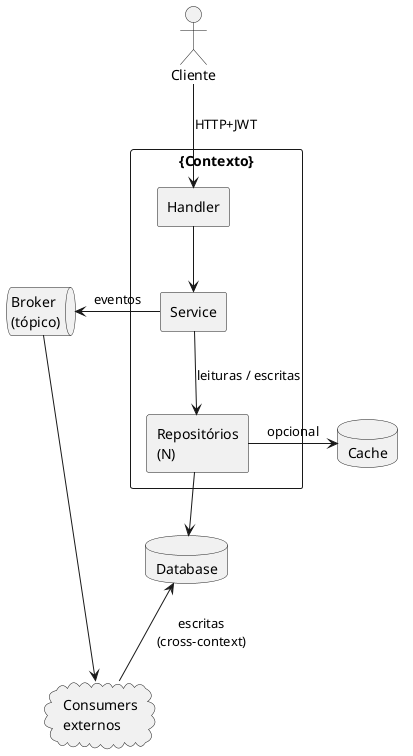
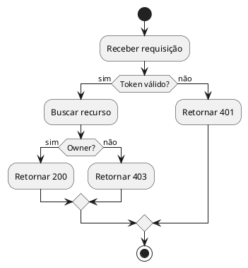
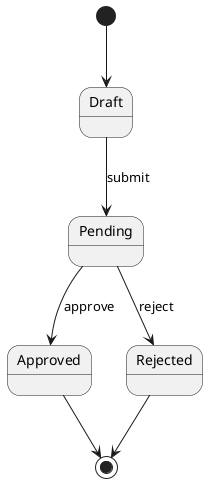
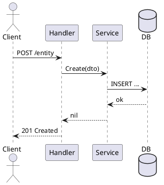

# Convenções de diagramas — cross-agent

Aplica-se a **todo agent** que produz artefato com diagrama (gofi-pd no
PRD, gofi-spec na spec SDD, gofi-eng/gofi-qa quando precisarem desenhar
fluxo num ADR ou laudo de auditoria, gofi-ui em handoff de UX). É regra
universal do toolchain — **não** decisão de domínio.

---

## Regra absoluta

> **Todo diagrama que descreva fluxo de funcionalidade deve ser escrito em
> PlantUML, dentro de bloco fenced `` ```plantuml ``.**

Nada de Mermaid, ASCII art, listas numeradas chamadas de "diagrama",
imagens externas (draw.io, Miro, screenshot) ou links para ferramentas
proprietárias. O markdown precisa ser auto-contido e renderizável fora
do contexto onde foi escrito.

---

## Escolha do tipo de diagrama — preferências

> **Default: prefira diagrama de atividade ou de componente. Sequência é
> último recurso.**

Diagrama de sequência (`participant ... -> ...`) descreve **bem** uma única
troca de mensagens entre dois atores; descreve **mal** um sistema com
múltiplas rotas, alternativas e laços — vira parede de texto vertical com
guards `alt/else/end` aninhados que ninguém lê em diff.

Hierarquia de preferência:

| Quando | Tipo recomendado | Por quê |
|---|---|---|
| Visão arquitetural / como as peças se conectam (§2 de SDD, "como o sistema é montado") | **Componente** (`component`, `database`, `queue`, `package`) | Mostra topologia em uma olhada; setas etiquetadas substituem prosa de "X chama Y" |
| Fluxo de processo com decisões / branches / loops (sync, login, ciclo de vida, fluxo de erro) | **Atividade** (`start`, `if/then/else`, `while`, `:ação;`) | Lê como fluxograma — natural para decisões de negócio, branches de validação, retry |
| Ciclo de vida de entidade (estados de um pedido, status de um job) | **Estado** (`[*] -> A -> B`) | Único formato que comunica "quais transições são possíveis" sem ambiguidade |
| Troca de **uma** sequência específica entre 2-3 atores que se quer documentar exata e cronologicamente (ex: handshake OAuth) | **Sequência** (`participant`, `-> / -->`) | Use **só** quando a ordem temporal e quem-fala-com-quem é a coisa principal a comunicar |

### Anti-padrão recorrente: sequência mega-condicional

```plantuml
== caso A ==
alt cond1
  ...
else cond2
  alt subcond
    ...
  end
end
== caso B ==
...
```

Ao detectar 3+ blocos `==` ou 2+ `alt` aninhados num diagrama de sequência,
**reescreva como atividade**. O resultado quase sempre fica metade do tamanho
e duas vezes mais legível.

### Diretrizes de legibilidade (qualquer tipo)

1. **Texto curto nas caixas** — `:Valida DTO;` em vez de
   `:Valida DTO do request via singleton package validator com tags...;`.
   Detalhes longos vão em `note right` / `note left` adjacente.
2. **Agrupe com `package` / `rectangle`** quando há sub-sistemas claros
   (camadas, serviços, módulos externos) — bordas dão contexto sem prosa.
3. **Setas etiquetadas com o que flui**, não com o verbo: `--> "JWT + body"`
   é mais útil que `--> "envia"`.
4. **Tracejado (`-.->`)** para chamadas opcionais ou caches; sólido
   (`-->`) para o caminho principal. Não misture sem critério.
5. **Direção consistente**: top-down para fluxo de request, left-right
   para fluxo cross-context. PlantUML aceita `-down->`, `-right->`, etc.
6. **Sem `skinparam` exótico** que destoe do resto do projeto. Defaults
   PlantUML são suficientes; `skinparam shadowing false` é OK por
   limpeza.

### O que conta como "diagrama de fluxo"

- Sequência de chamadas entre camadas (handler → service → repository → DB)
- Fluxo de auth/login (browser → IDP → callback → cookie)
- Máquina de estados / ciclo de vida de entidade
- Fluxo de evento ou mensageria (publisher → broker → consumer)
- Orquestração cross-context (saga, workflow, processo de negócio)
- Diagrama de contexto (componentes do bounded context)
- BPMN de processo de negócio em PRD

### O que **não** precisa ser PlantUML

- Tabelas (use tabela markdown)
- Listas de regras/passos puramente textuais
- Schema de banco simples (use bloco SQL, não diagrama ER)
- Estrutura de pastas (use bloco texto / `tree`)

---

## Por que PlantUML

1. **Determinístico** — mesmo input gera o mesmo SVG; revisão de PR
   mostra diff real, não pixels.
2. **Versionável** — vive em git como texto, segue o ciclo de vida da
   spec/PRD/laudo.
3. **Self-contained** — não depende de serviço externo (draw.io, Miro)
   que pode sumir, mudar ACL ou indexar conteúdo sensível.
4. **Renderizável onde os agents leem** — IDEs, GitHub, editores de
   markdown e o pipeline gofi assumem PlantUML como formato canônico.
5. **Cross-agent** — gofi-spec lê o BPMN do gofi-pd e gofi-eng lê o
   diagrama de sequência do gofi-spec. Formato único elimina conversão.

---

## Catálogo mínimo de tipos

Apresentado na ordem de preferência (ver §"Escolha do tipo de diagrama").

### Componente — visão arquitetural / diagrama de contexto

Default para §2 de SDD e qualquer "como o sistema se monta".



### Atividade — fluxo com decisões / branches / loops

Default para §4 de SDD quando há guards, validações encadeadas ou
ramos de erro a documentar.



### Estado — ciclo de vida de entidade

Único formato que comunica transições válidas sem ambiguidade.



### Sequência — usar com parcimônia

Apenas quando a ordem cronológica entre 2-3 atores é a informação
principal e o fluxo é razoavelmente linear (poucos `alt`, sem `==
seções ==` múltiplas).



> Se o seu diagrama de sequência tem 3+ blocos `==`, 2+ `alt` aninhados
> ou cobre múltiplas rotas/casos de uso, **converta para atividade ou
> componente**. Ver §"Anti-padrão recorrente".

> Os exemplos acima usam placeholders (`{Contexto}`, `entity`) — knowledge
> é domínio-neutro. Ao escrever no PRD/spec real, substitua pelos nomes
> da linguagem ubíqua do contexto.

---

## Anti-padrões

- ` ```mermaid ` — banido. Migrar para PlantUML quando encontrar legado.
- "Diagrama: 1) cliente chama X; 2) X chama Y; …" — isso é lista, não
  diagrama. Se a sequência merece um diagrama, escreva em PlantUML; se
  não, deixe como texto e não chame de diagrama.
- ASCII boxes (`+----+   +----+`) — ilegível em diff e impossível de
  manter conforme o fluxo cresce.
- Link para draw.io / Miro / Lucid — quebra fora da intranet, expira,
  não versiona, e pode vazar conteúdo sensível para terceiros.
- Imagem PNG/JPG embarcada — não é editável, não diff-a, e em revisão
  cega o que mudou.

---

## Onde isso aparece no pipeline

| Artefato | Seção | Responsável |
|----------|-------|-------------|
| PRD | §10 BPMN — Fluxo de Negócio | gofi-pd |
| Spec SDD | §2 Diagrama de Contexto + qualquer §X com fluxo | gofi-spec |
| ADR dentro da spec | quando ADR descreve trade-off de fluxo | gofi-spec |
| Laudo de QA | quando o laudo precisa demonstrar divergência de fluxo | gofi-qa |
| Handoff de UX | jornada do usuário multi-tela | gofi-ui |

Cada agent referencia este arquivo na sua pré-execução; nenhum agent
duplica a regra na própria skill.
