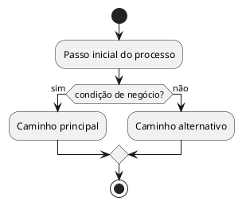

# TEMPLATE PADRÃO — PRD / REQUISITO DE NEGÓCIO

---

# TÍTULO DO PROJETO: `<Nome do Projeto>`

---

# `<CÓDIGO>` — `<Nome do Requisito>`

Ex: `RN-01 — Gestão de Cadastro de Pessoas`

---

## 1. Informações Gerais

| Campo        | Valor |
|-------------|------|
| Versão       | 1.0 |
| Autor        |  |
| Data         |  |
| Status       | Draft / Em andamento / Aprovado |
| Stakeholders |  |

---

## 2. Contexto de Negócio

Descreva o problema atual e o cenário que motivou este requisito.

- Problema 1  
- Problema 2  
- Problema 3  

---

## 3. Objetivo do Requisito

Descreva claramente o que este requisito pretende resolver.

> Ex: Permitir que...

---

## 4. Definições (Opcional)

| Termo  | Definição |
|--------|----------|
|        |          |

---

## 5. Escopo

### 5.1 Dentro do Escopo

- Item 1  
- Item 2  
- Item 3  

### 5.2 Fora do Escopo

- Item 1  
- Item 2  
- Item 3  

---

## 6. Personas / Usuários Impactados

| Persona  | Descrição | Permissões |
|----------|----------|-----------|
|          |          |           |

---

## 7. Descrição do Processo de Negócio

Descreva o fluxo de forma narrativa (alto nível).

- Etapa 1  
- Etapa 2  
- Etapa 3  

**Resultado esperado:**
> Descreva o resultado final do processo

---

## 8. Regras de Negócio

| Código | Regra |
|--------|------|
| RN-01  |      |
| RN-02  |      |
| RN-03  |      |

---

## 9. Fluxo de Negócio

### Fluxo Principal

1. Passo 1  
2. Passo 2  
3. Passo 3  

### Fluxos Alternativos

- FA-01:  
- FA-02:  

### Fluxos de Exceção

- FE-01:  
- FE-02:  

---

## 10. BPMN — Fluxo de Negócio

> Formato obrigatório: PlantUML (` ```plantuml `, normalmente
> `activity` ou `sequence`). **Não** usar Mermaid, ASCII art ou link
> para draw.io/Miro. Detalhes e exemplos em
> `.claude/knowledge/shared/diagram-conventions.md`.



---

## 11. Entradas e Saídas

### Entradas

| Informação | Origem | Obrigatório | Observação |
|------------|--------|------------|------------|
|            |        | Sim/Não     |            |

### Saídas

| Resultado | Destino | Observação |
|----------|--------|------------|
|          |        |            |

---

## 12. Critérios de Aceite

**CA-01**  
Dado que...  
Quando...  
Então...  

**CA-02**  
Dado que...  
Quando...  
Então...  

---

## 13. Requisitos Funcionais (RF)

| Código | Descrição | Referência |
|--------|----------|------------|
| RF-01  |          | RN-XX |
| RF-02  |          | RN-XX |

---

## 14. Requisitos Não Funcionais (RNF)

| Código | Categoria | Descrição |
|--------|----------|-----------|
| RNF-01 | Performance | |
| RNF-02 | Segurança   | |
| RNF-03 | Confiabilidade | |

---

## 15. Modelo de Dados (Opcional)

| Campo | Descrição | Obrigatório |
|------|----------|------------|
|      |          | Sim/Não |

---

## 16. Regras de Validação (Opcional)

| Campo | Regra | Obrigatório |
|------|------|------------|
|      |      | Sim/Não |

---

## 17. Considerações Técnicas (Opcional)

- Arquitetura sugerida  
- Dependências  
- Integrações futuras  
- Estratégias de escalabilidade  

---

## 18. Riscos e Premissas

### Riscos

- Risco 1  
- Risco 2  

### Premissas

- Premissa 1  
- Premissa 2  

---

## 19. Análise de Impactos

Questionário para mapear os efeitos (positivos e negativos) que esta feature pode
gerar. Responda cada pergunta; quando não houver impacto, registre **"Sem impacto"**
para deixar explícito que o ponto foi avaliado.

### 19.1 Impactos Positivos

| # | Pergunta | Resposta | Área/Funcionalidade afetada | Intensidade (Baixa/Média/Alta) |
|---|----------|----------|-----------------------------|-------------------------------|
| 1 | Que benefício direto a feature traz ao **cliente/usuário final**? | | | |
| 2 | Quais **outras funcionalidades** são beneficiadas ou potencializadas? | | | |
| 3 | Quais **áreas/equipes internas** ganham com isso (ex: suporte, comercial, financeiro, operações)? | | | |
| 4 | Há ganho de **eficiência operacional** (redução de tempo, custo, retrabalho)? | | | |
| 5 | Gera **vantagem competitiva** ou diferencial de mercado? | | | |
| 6 | Contribui para **receita, retenção ou conversão**? | | | |

### 19.2 Impactos Negativos / Riscos de Impacto

| # | Pergunta | Resposta | Área/Funcionalidade afetada | Severidade (Baixa/Média/Alta) | Mitigação |
|---|----------|----------|-----------------------------|-------------------------------|-----------|
| 1 | Quais **funcionalidades existentes** podem quebrar, mudar de comportamento ou ser depreciadas? | | | | |
| 2 | Há impacto negativo na **experiência do cliente/usuário** (curva de aprendizado, mudança de fluxo)? | | | | |
| 3 | Quais **áreas/equipes internas** terão sobrecarga ou precisarão se adaptar? | | | | |
| 4 | Existe risco de **performance, segurança ou disponibilidade**? | | | | |
| 5 | Há **dependências ou integrações** que podem ser afetadas? | | | | |
| 6 | Gera **dívida técnica**, custo de manutenção ou esforço de migração? | | | | |
| 7 | Há impacto em **dados existentes** (migração, perda, inconsistência)? | | | | |

### 19.3 Síntese de Impacto

| Tipo | Resumo | Balanço final |
|------|--------|---------------|
| Positivo |  | |
| Negativo |  | |

> **Conclusão:** o saldo dos impactos justifica seguir com a feature? (Sim / Não / Com ressalvas — descreva)

---

## 20. Anexos

- Diagramas  
- Documentos de apoio  
- Links úteis  