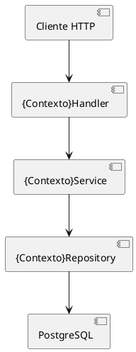

# SDD — {NomeDoContexto}

**Versão:** 1.0  
**Data:** {data}  
**Status:** Rascunho | Em Revisão | Aprovado  
**Autor:** {nome}

---

## 0. Manifesto do Serviço

| Atributo | Valor |
|---|---|
| **Nome do serviço** | {nome-do-serviço} |
| **Caminho no monorepo** | {services/nome-do-serviço/} |
| **Go module** | {github.com/org/projeto/services/nome-do-serviço} |
| **Banco de dados** | {PostgreSQL} |
| **Porta HTTP** | {8080} |
| **Prefixo de rotas** | {/api/v1} |
| **Redis** | {sim — sessão/cache | não} |
| **Serviço novo** | {sim | não} |
| **Contextos já existentes** | {lista ou "nenhum"} |
| **Middleware de auth existente** | {sim | não} |

### Estrutura raiz do serviço

```
{services/nome-do-serviço/}
  main.go
  go.mod
  src/
    {contexto}/
      model/          — entity.go + dto.go
      service/        — errors.go + {contexto}_service.go + _test.go
      repository/     — {contexto}_repository.go (arquivo único: interface + implementação)
      adapter/        — iam_adapter.go (apenas quando integra com SDK externo)
      handler/        — middleware.go (se auth) + {contexto}_handler.go + auth_handler.go (se auth)
  .migrations/
```

---

## 0.1 Decisões de Arquitetura e Padrões

| Decisão | Valor |
|---------|-------|
| **Cache** | {Redis TTL=Xs em {operação} \| não} |
| **Mensageria** | {publica `{evento}` em `{tópico}` via {broker} \| não} |
| **Consome eventos** | {consome `{tópico}` → {ação} \| não} |
| **Filtro dinâmico** | {sim — `POST /{ctx}s/schemas` + `POST /{ctx}s/query` \| não} |
| **Padrões de projeto** | {CQRS \| Saga \| Strategy \| Factory \| idempotência \| nenhum} |
| **Rate limiting** | {por usuário / por IP \| não} |
| **Auditoria de operações** | {sim \| não} |
| **Variáveis de ambiente adicionais** | {lista ou "padrão"} |
| **Integrações externas** | {lista ou "nenhuma"} |

### Contratos de Camada

> Esta seção documenta os contratos Go esperados para cada camada, derivados da modelagem DDD.

**Repository — interface:**
```go
type {Contexto}Repository interface {
    // {operação}: {descrição breve}
    Save(ctx context.Context, e model.{Entidade}) (*model.{Entidade}, error)
    FindByID(ctx context.Context, id {tipo}) (*model.{Entidade}, error)
    // FindByDynamicQuery: apenas quando filtro dinâmico está ativo
    FindByDynamicQuery(ctx context.Context, filters *sqln.Filters) (model.{Contexto}QueryResponse, error)
    // ...
}
```

**Service — interface:**
```go
type {Contexto}Service interface {
    // {operação}: {descrição breve}
    Create(ctx context.Context, req model.Create{Entidade}Request) (*model.{Entidade}, errs.AppError)
    // GetByDynamicQuery: apenas quando filtro dinâmico está ativo
    GetByDynamicQuery(ctx context.Context, filters *sqln.Filters) (model.{Contexto}QueryResponse, errs.AppError)
    // ...
}
```

**Handler — rotas:**
```
{MÉTODO} {prefixo}/{recurso}         → handler.{operação}   [{acesso}]
{MÉTODO} {prefixo}/{recurso}/{id}    → handler.{operação}   [{acesso}]
```

---

## 1. Visão Geral

> Descrição de 2-3 parágrafos: o que é esse contexto, qual problema de negócio resolve, quais os limites do domínio.

---

## 2. Diagrama de Contexto

> Formato obrigatório: PlantUML (` ```plantuml `). Demais convenções e tipos
> de diagrama em `.claude/knowledge/shared/diagram-conventions.md`.



---

## 3. Modelo de Dados

### 3.1 Entidade Principal

| Campo | Tipo Go | Coluna SQL | Obrigatório | Descrição |
|-------|---------|------------|-------------|-----------|
| ID | string | id | sim | UUID gerado pelo banco |
| Name | string | name | sim | Nome completo |
| Email | string | email | sim | E-mail único |
| CreatedAt | time.Time | created_at | sim | Timestamp de criação |

### 3.2 Tabela SQL

```sql
CREATE TABLE {contexto}s (
    id BIGINT GENERATED ALWAYS AS IDENTITY PRIMARY KEY,
    name       VARCHAR(255) NOT NULL,
    email      VARCHAR(255) NOT NULL UNIQUE,
    created_at TIMESTAMPTZ  NOT NULL DEFAULT NOW()
);
```

---

## 4. Operações

### 4.1 Criar {Contexto}

**Endpoint:** `POST /v1/{contextos}`  
**Auth:** Não requerida | Bearer token

**Request:**
```json
{
  "name": "string",
  "email": "string"
}
```

**Responses:**

| Status | Situação |
|--------|----------|
| 201 | Criado com sucesso |
| 400 | Dados inválidos (validação) |
| 409 | Conflito ({campo} já existe) |
| 500 | Erro interno |

---

### 4.2 Atualizar {Contexto}

**Endpoint:** `PUT /v1/{contextos}/{id}`  
**Auth:** Bearer token

**Request:**
```json
{
  "name": "string",
  "email": "string"
}
```

**Responses:**

| Status | Situação |
|--------|----------|
| 204 | Atualizado com sucesso |
| 400 | Dados inválidos |
| 404 | {Contexto} não encontrado |
| 500 | Erro interno |

---

### 4.3 Buscar por ID

**Endpoint:** `GET /v1/{contextos}/{id}`  

**Responses:**

| Status | Situação |
|--------|----------|
| 200 | Encontrado — retorna entidade |
| 404 | Não encontrado |

---

### 4.4 Listar com Filtros

**Endpoint:** `GET /v1/{contextos}?name=&page=0&limit=15`

**Query Params:**

| Param | Tipo | Default | Descrição |
|-------|------|---------|-----------|
| name | string | — | Filtro por nome (ILIKE) |
| page | uint16 | 0 | Página (0-indexed) |
| limit | uint16 | 15 | Registros por página |

**Precedência de filtros:** `{campo1}` tem precedência sobre `{campo2}`.

**Response 200:**
```json
{
  "data": [...],
  "total": 10,
  "totalPages": 2,
  "currentPage": 0,
  "limit": 5
}
```

---

### 4.5 Schema de Filtro Dinâmico _(quando filtro dinâmico ativo)_

**Endpoint:** `POST /v1/{contextos}/schemas`  
**Auth:** {conforme definido}  
**Body:** nenhum

**Response 200:**
```json
{
  "allowedFields": [
    { "key": "p.name", "label": "NAME", "filterType": "text" }
  ],
  "allowedSortingFields": { "Name": "sortedBy" },
  "operators": { "eq": "eq", "contains": "contains" },
  "logicalOperators": { "and": "and", "or": "or" }
}
```

---

### 4.6 Query Dinâmica _(quando filtro dinâmico ativo)_

**Endpoint:** `POST /v1/{contextos}/query`  
**Auth:** {conforme definido}

**Campos filtráveis:**

| Label | Key SQL | FilterType | Operadores permitidos |
|-------|---------|------------|----------------------|
| NAME  | p.name  | text       | eq, contains         |

**Campos ordenáveis:** {lista}

**Filtro default** (quando body vazio ou `filters` não enviado): `{campo} = {valor}`

**Request:**
```json
{
  "filters": [
    { "field": "NAME", "operator": "contains", "value": "produto" }
  ]
}
```

**Responses:**

| Status | Situação |
|--------|----------|
| 200 | Retorna `sqln.Page[{Ctx}Query]` paginado |
| 400 | Filtro inválido — campo ou operador não permitido |
| 500 | Erro interno |

---

### 4.5 Deletar {Contexto}

**Endpoint:** `DELETE /v1/{contextos}/{id}`

**Responses:**

| Status | Situação |
|--------|----------|
| 204 | Deletado com sucesso |
| 404 | Não encontrado |

---

## 5. Regras de Negócio

### RN-01 — {Nome da Regra}
> Descrição da regra.  
> **Implementação:** service/{contexto}_service.go  
> **Erro:** `Err{Contexto}Validation`

### RN-02 — {Nome da Regra}
> Descrição da regra.  
> **Implementação:** service/{contexto}_service.go  
> **Erro:** `Err{Contexto}Conflict`

---

## 6. Validações de DTO

### CreateRequest

| Campo | Validação | Erro esperado |
|-------|-----------|---------------|
| Name | required | Campo obrigatório |
| Email | required, email | E-mail inválido |

### UpdateRequest

| Campo | Validação | Erro esperado |
|-------|-----------|---------------|
| Name | required | Campo obrigatório |
| Email | required, email | E-mail inválido |

---

## 7. Erros do Serviço

| Var | Kind | Code | Situação |
|-----|------|------|----------|
| `Err{C}NotFound` | NotFound | `{C}_NOT_FOUND` | Entidade não existe |
| `Err{C}Conflict` | Conflict | `{C}_CONFLICT` | Violação de unicidade |
| `Err{C}Validation` | Validation | `{C}_VALIDATION` | DTO inválido |
| `Err{C}Create` | Operation | `{C}_CREATE_FAILED` | Falha ao inserir |
| `Err{C}Update` | Operation | `{C}_UPDATE_FAILED` | Falha ao atualizar |
| `Err{C}Delete` | Operation | `{C}_DELETE_FAILED` | Falha ao deletar |
| `Err{C}Query` | Operation | `{C}_QUERY_FAILED` | Falha ao consultar |

---

## 8. Estrutura de Arquivos

```
src/{contexto}/
├── model/
│   ├── entity.go          # {Entidade} struct, {Entidade}Response type
│   ├── dto.go             # CreateRequest, UpdateRequest, Filter + Validate()
│   └── query_dto.go       # {Ctx}QueryMapping(), {Ctx}QueryResponse, {Ctx}Query  ← apenas se filtro dinâmico
├── service/
│   ├── errors.go          # Vars de erros registrados
│   ├── {contexto}_service.go
│   └── {contexto}_service_test.go
├── repository/
│   └── {contexto}_repository.go
└── handler/
    ├── {contexto}_handler.go
    └── {contexto}_handler_test.go
```

---

## 9. ADR — Decisões Arquiteturais

### ADR-01 — {Título da decisão}

**Status:** Aceito  
**Contexto:** {Situação que levou à decisão}  
**Decisão:** {O que foi decidido}  
**Consequências:** {Impactos positivos e negativos}

---

## 10. Rastreabilidade

| Tarefa | Agente | Status | Arquivo |
|--------|--------|--------|---------|
| Criação da spec | gofi-spec | ✅ | specs/{contexto}/sdd-{contexto}.md |
| Implementação | gofi-eng | ⬜ | src/{contexto}/ |
| Auditoria ui | gofi-ui | ⬜ | — |
| Auditoria QA | gofi-qa | ⬜ | — |
| Documentação doc | gofi-doc | ⬜ | — |
